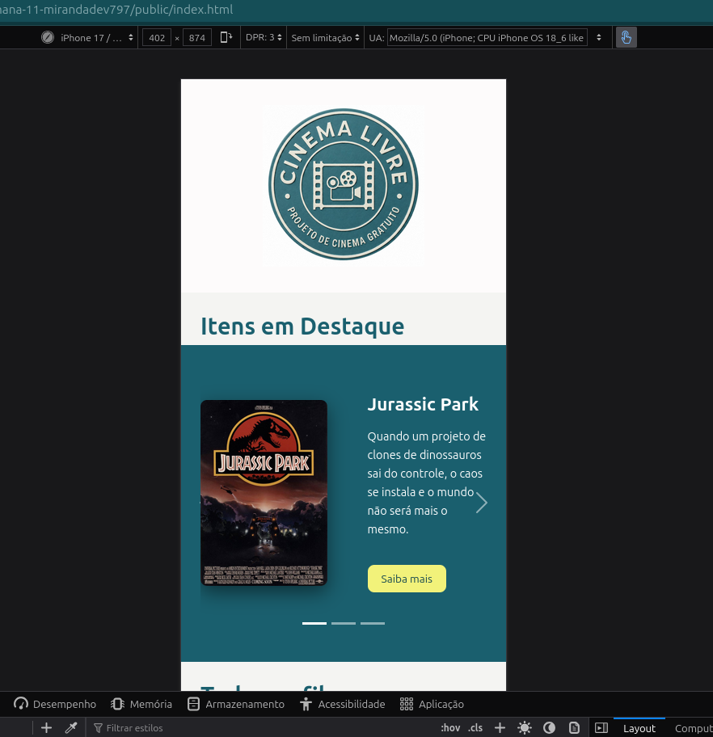
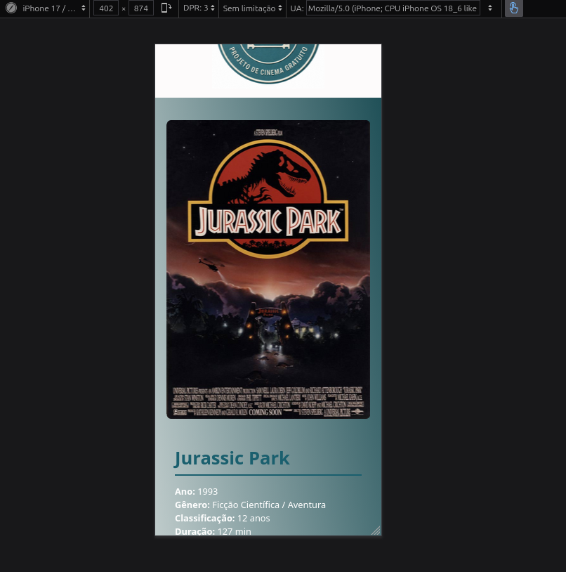

# Trabalho Prático - Semana 11

Nesta atividade, vamos dar continuidade ao projeto desenvolvido ao longo deste semestre, acrescentando a página de detalhes da aplicação.

Imagine que a página principal (home-page) mostre uma visão dos vários itens que existem no seu site. Ao clicar em um item, você é direcionado para a página de detalhes. A página de detalhes vai mostrar todas as informações sobre o item do seu projeto, seja esse item uma notícia, filme, receita, lugar turístico ou evento.

## Informações Gerais

- Nome: Marina Miranda Nunes
- Matrícula: 927429
- Descreva brevemente seu projeto: uma página web de divulgação para um projeto de exibição de filmes no estilo de cinema de rua.

## Prints do trabalho

COLOQUE A IMAGEM - HOME-PAGE - 

COLOQUE A IMAGEM - TELA DE DETALHES - 

## Dados em JSON
Inclua abaixo a estrutura de dados definida para o seu projeto, apresentando pelo menos dois exemplos de registros em formato JSON.

```json
{
  "filmes": 
    {
      "id": 1,
      "nome": "Jurassic Park",
      "ano": 1993,
      "genero": "Ficção Científica / Aventura",
      "classificacao": "12 anos",
      "duracao": "127 min",
      "destaque": true,
      "data_sessao": "2026-07-04",
      "horario": "20:00",
      "descricao": "Quando um projeto de clones de dinossauros sai do controle, o caos se instala e o mundo não será mais o mesmo.",
      "imagem_principal": "img/cartaz1.jpg",
      "fotos": [
        { "id": 1, "titulo": "Cena 1", "imagem": "img/fotos/cena_jurassicpark.jpg" },
        { "id": 2, "titulo": "Cena 2", "imagem": "img/fotos/cena_2jurassicpark.jpg" }
      ]
    },
    {
      "id": 2,
      "nome": "Interestelar",
      "ano": 2014,
      "genero": "Ficção Científica / Drama",
      "classificacao": "10 anos",
      "duracao": "169 min",
      "destaque": true,
      "data_sessao": "2026-07-18",
      "horario": "20:00",
      "descricao": "Um ex-piloto parte em uma missão espacial pela sobrevivência da humanidade, buscando um novo lar para a espécie.",
      "imagem_principal": "img/cartaz2.jpeg",
      "fotos": [
        { "id": 1, "titulo": "Cena 1", "imagem": "img/fotos/inter.webp" },
        { "id": 2, "titulo": "Cena 2", "imagem": "img/fotos/intersetella3.jpg" }
      ]
    }
  
}
```


